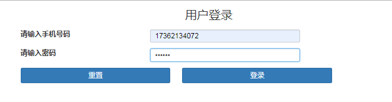
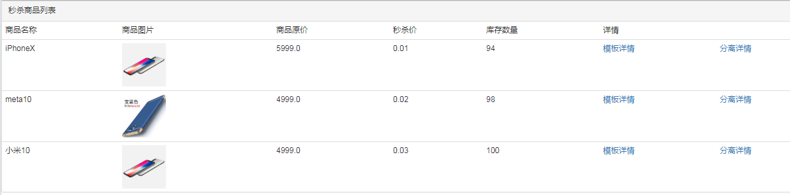
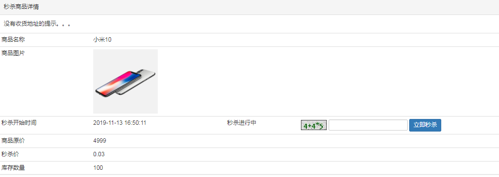
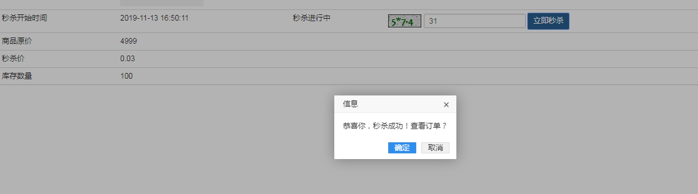
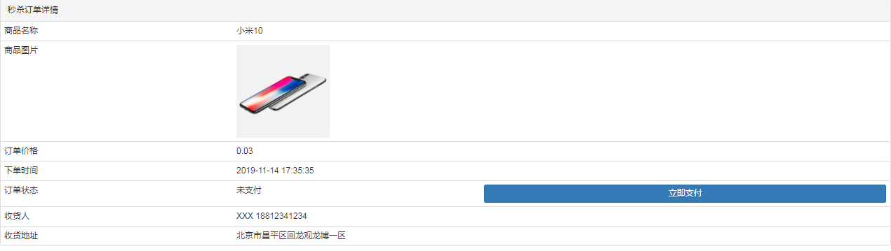

* content
{:toc}
### 项目搭建

- springboot环境
- 集成Thymeleaf，Result结果封装
- 集成mysql+mybatis+Druid
- 集成jedis+Redis安装+通用缓存key封装
- 引用RabbitMQ
- 使用数学公式验证码分流
- 自定义注解实现接口防刷

### 登录功能

#### 数据库

```sql
CREATE TABLE `miaosha_user` (
	`id` bigint(20) NOT NULL COMMENT '用户id，手机号码',
    `nickname` varchar(255) NOT NULL COMMENT '用户昵称',
    `password` varchar(32) DEFAULT NULL COMMENT 'MD5(MD5(pass明文+固定salt)+salt)',
    `salt` varchar(10) DEFAULT NULL COMMENT '盐',
    `head` varchar(128) DEFAULT NULL COMMENT '头像，云存储ID',
    `register_date` datetime DEFAULT NULL COMMENT '注册时间',
    `last_login_date` datetime DEFAULT NULL COMMENT '上次登录时间',
    `login_count` int(11) DEFAULT '0' COMMENT '登录次数',
    PRIMARY KEY(`id`)
)ENGINE=InnoDB DEFAULT CHARSET=utf8mb4 COMMENT='用户表';
```

#### 两次MD5

- 用户端：pass = MD5（明文+固定salt）
- 服务端：pass = MD5（用户输入+随机salt）
- miaosha_2：com.imooc.miaosha.util.MD5Util

#### JSR303参数校验

- 给Controller层方法中接收参数VO对象前加@Valid注解，然后给VO对象需要校验的属性进行注解添加
- miaosha_2：com.imooc.miaosha.controller.LoginController
- miaosha_2：com.imooc.miaosha.vo.LoginVo
- miaosha_2：com.imooc.miaosha.validator.IsMobile（自定义校验手机号注解）
- miaosha_2：com.imooc.miaosha.validator.IsMobileValidator（手机号校验器）

#### 全局异常拦截器

- miaosha_2：com.imooc.miaosha.exception.GlobalExceptionHandler（自定义全局异常处理器，以json形式返回错误信息）
- miaosha_2：com.imooc.miaosha.exception.GlobalException（全局异常）

#### 分布式session

- 登录成功---》使用随机数生成一个token---》把token和登录的用户信息写入Redis缓存中---》把token放入cookie中---》把cookie放入response返回给前端---》跳转到商品列表页
- 通过springmvc的参数赋值配置，把前台传过来的cookie进行解析，得到token，通过token从Redis中查询到用户信息
- miaosha_2：com.imooc.miaosha.controller.LoginController#doLogin（登录）
- miaosha_2：com.imooc.miaosha.config.WebConfig（springmvc参数赋值配置）
- miaosha_2：com.imooc.miaosha.config.UserArgumentResolver（用户参数解析器）
- miaosha_2：com.imooc.miaosha.controller.GoodsController#list（跳转到商品列表页）



### 秒杀功能

#### 数据库

```sql
CREATE TABLE `goods`(
	`id` bigint(20) NOT NULL AUTO_INCREMENT COMMENT '商品id',
    `goods_name` varchar(16) DEFAULT NULL COMMENT '商品名称',
    `goods_title` varchar(64) DEFAULT NULL COMMENT '商品标题',
    `goods_img` varchar(64) DEFAULT NULL COMMENT '商品图片',
    `goods_detail` longtext COMMENT '商品详细介绍',
    `goods_price` decimal(10,2) DEFAULT '0.00' COMMENT '商品单价',
    `goods_stock` int(11) DEFAULT '0' COMMENT '商品库存，-1表示没有限制',
    PRIMARY KEY (`id`)
)ENGINE=InnoDB AUTO_INCREMENT=3 DEFAULT CHARSET=utf8mb4 COMMENT='商品表';
```

```sql
CREATE TABLE `miaosha_goods`(
	`id` bigint(20) NOT NULL AUTO_INCREMENT COMMENT '秒杀商品id',
    `goods_id` bigint(20) DEFAULT NULL COMMENT '商品id',
    `miaosha_price` decimal(10,2) DEFAULT '0.00' COMMENT '秒杀价',
    `stock_count` int(11) DEFAULT NULL COMMENT '库存数量',
    `start_date` datetime DEFAULT NULL COMMENT '秒杀开始时间',
    `end_date` datetime DEFAULT NULL COMMENT '秒杀结束时间',
    PRIMARY KEY (`id`)
)ENGINE=InnoDB AUTO_INCREMENT=3 DEFAULT CHARSET=utf8mb4 COMMENT='秒杀商品表';
```

```sql
CREATE TABLE `order_info`(
	`id` bigint(20) NOT NULL AUTO_INCREMENT COMMENT '订单id',
    `user_id` bigint(20) DEFAULT NULL COMMENT '用户id',
    `goods_id` bigint(20) DEFAULT NULL COMMENT '商品id',
    `delivery_addr_id` bigint(20) DEFAULT NULL COMMENT '收货地址id',
    `goods_name` varchar(16) DEFAULT NULL COMMENT '冗余过来的商品名称',
    `goods_count` int(11) DEFAULT '0' COMMENT '商品数量',
    `goods_price` decimal(10,2) DEFAULT '0.00' COMMENT '商品单价',
    `order_channel` tinyint(4) DEFAULT '0' COMMENT '1PC 2Android 3iOS',
    `status` tinyint(4) DEFAULT '0' COMMENT '订单状态：0新建未支付，1已支付，2已发货，3已收货，4已退款，5已完成',
    `create_date` datetime DEFAULT NULL COMMENT '订单创建时间',
    `pay_date` datetime DEFAULT NULL COMMENT '支付时间',
    PRIMARY KEY(`id`)
)ENGINE=InnoDB AUTO_INCREMENT=12 DEFAULT CHARSET=utf8mb4 COMMENT='订单详情表';
```

```sql
CREATE TABLE `miaosha_order`(
	`id` bigint(20) NOT NULL AUTO_INCREMENT COMMENT '主键id',
    `user_id` bigint(20) DEFAULT NULL COMMENT '用户id',
    `order_id` bigint(20) DEFAULT NULL COMMENT '订单id',
    `goods_id` bigint(20) DEFAULT NULL COMMENT '商品id',
    PRIMARY KEY(`id`)
    UNIQUE KEY `u_uid_gid` (`user_id`,`goods_id`) USING BTREE
)ENGINE=InnoDB AUTO_INCREMENT=3 DEFAULT CHARSET=utf8mb4 COMMENT='秒杀订单表';
```

#### 秒杀逻辑

- miaosha_2：com.imooc.miaosha.controller.GoodsController#list（商品列表）
- miaosha_2：com.imooc.miaosha.controller.GoodsController#detail（获取商品详情）
- miaosha_2：com.imooc.miaosha.controller.MiaoshaController#list（执行秒杀）
  - 如果用户没有登录，跳转到登录界面
  - 判断库存，库存不足，跳转到错误页面，显示错误信息
  - 判断是否已经秒杀到了，不能重复秒杀（使用用户id和商品id组成的唯一索引）
  - 减库存 下订单 写入秒杀订单









### JMeter压测

- 使用JMeter工具对商品列表接口进行压力测试

### 页面优化

#### 页面缓存（Thymeleaf）

- 把商品列表页和商品详情页进行缓存

  - 配合使用produces = "text/html"，@ResponseBody

  - 1：从Redis中获取渲染完的页面缓存
  - 2：如果缓存中没有则查询数据库渲染页面，把渲染完的页面放入缓存实现手动渲染

- miaosha_2：com.imooc.miaosha.controller.GoodsController#list

- miaosha_2：com.imooc.miaosha.controller.GoodsController#detail2

#### 对象缓存

- 把一些不经常修改的对象放入Redis缓存，避免和数据库过多的直接交互
- miaosha_2：com.imooc.miaosha.service.MiaoshaUserService#getById
- miaosha_2：com.imooc.miaosha.service.MiaoshaUserService#updatePassword
- miaosha_2：com.imooc.miaosha.service.MiaoshaUserService#getByToken

#### 前后分离

- com.imooc.miaosha.controller.GoodsController#detail

### RabbitMQ异步下单

- 使用RabbitMQ对秒杀接口进行优化

- （1）：系统初始化，把商品库存数量加载到Redis缓存中

  - com.imooc.miaosha.controller.MiaoshaController#afterPropertiesSet

  （2）：收到请求，Redis预减库存，库存不足直接返回

  - com.imooc.miaosha.controller.MiaoshaController#miaosha2

  （3）：请求入队（RabbitMQ），给前台返回一个“排队中”

  （4）：请求出队，生成订单，减少库存

  - com.imooc.miaosha.rabbitmq.MQReceiver#receive

  （5）：客户端轮询，是否秒杀成功

### 安全优化

#### 秒杀地址隐藏

- com.imooc.miaosha.controller.MiaoshaController#getMiaoshaPath（当浏览器点击秒杀按钮时，先发送请求获取到一个安全码，然后带上安全码去访问秒杀接口）

#### 数学公式验证码

- 为了降低同一时间内请求秒杀接口的数量，设置一个数字计算验证码来分流

#### 接口防刷

- com.imooc.miaosha.access.AccessLimit（自定义接口防刷注解，限制接口在一定时间内的访问次数）
- com.imooc.miaosha.access.AccessInterceptor（编写限流拦截器）
- com.imooc.miaosha.config.WebConfig（注册限流拦截器）
- com.imooc.miaosha.controller.MiaoshaController#getMiaoshaPath（给获取秒杀地址接口添加限流注解）